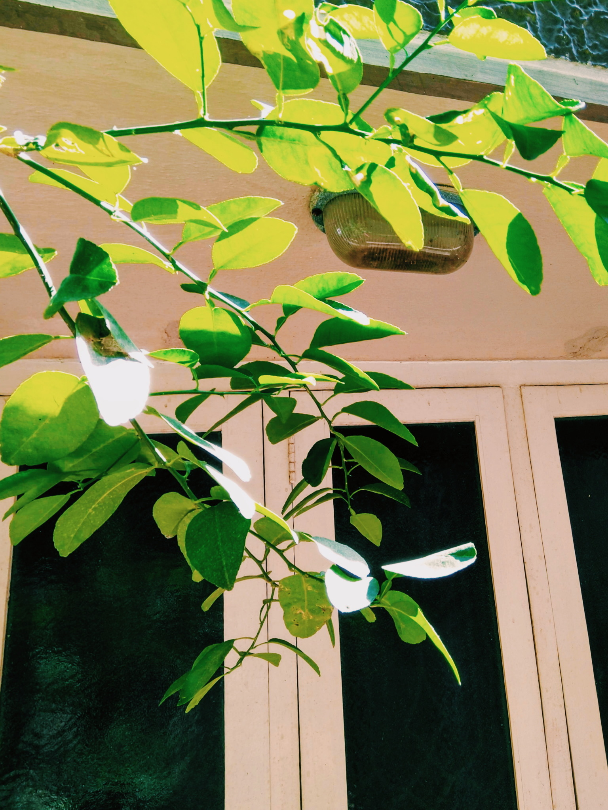

# 🌿
# Hallo! I'm Jayasurya, this is my digital garden.

<!-- 

Other places—
&nbsp;
<a style="color: teal" class="internal-link no-preview" href="/portfolio"><b>Design Portfolio</b></a>
&nbsp;
<a style="color: teal" class="internal-link no-preview" href="/now"><b>Now</b></a>

 -->

<!--  -->
Here I organize my thoughts, observations, and bits of information.
Something like a digital mind, a second brain, where I curate the things I know, the things I think I know and everything else.

Good entry points into the garden—  

  
[[design|"Design"]]

  
[[Graphical User Interfaces]]

  
[[Dart Language]]

  
[[Functional and Imperative]]

  
[[Thought abstractions]]

  <!-- 
[[Minecraft]]
 -->
  <!-- 
[[Dune]]
 -->
  
[[Gardening]] (meta)

  <!-- 
[[I'm a cat person]] (first)
 -->
  

  
I update it twice a week.   
   
It's like a living blog that's also a public notes repository. To know more, look at this [cool article by Maggie Appleton](https://maggieappleton.com/garden-history)

